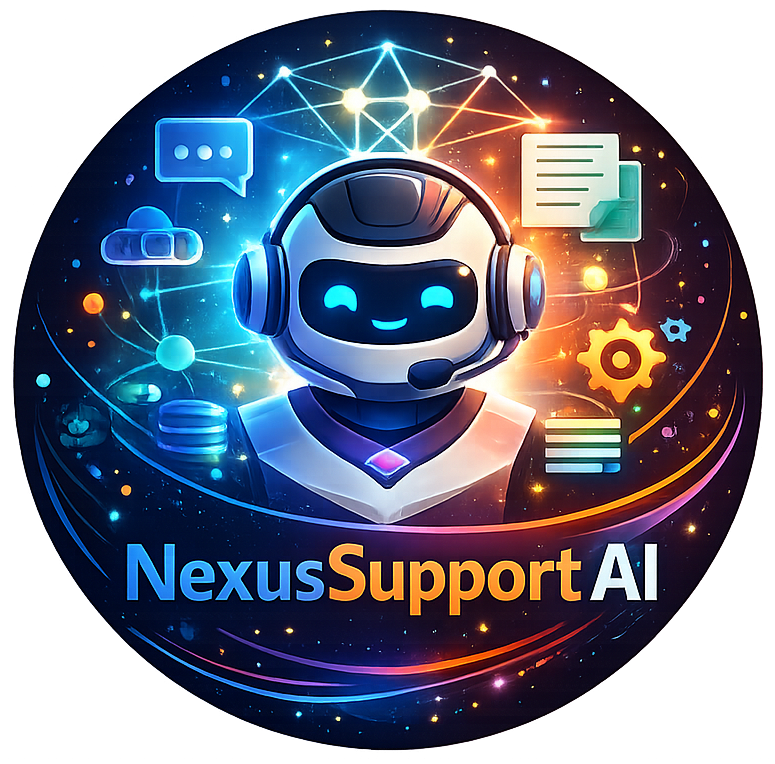

<div align="center">



# NexusSupport AI

### Intelligent Support Orchestration with ML, RAG, LLMs & AI Agents

<p>
  <strong>Classify</strong> ·
  <strong>Retrieve</strong> ·
  <strong>Decide</strong> ·
  <strong>Generate</strong> ·
  <strong>Escalate</strong> ·
  <strong>Monitor</strong>
</p>

</div>

---

## ✦ Overview

**NexusSupport AI** is an end-to-end AI engineering project that brings together classical machine learning, transformer-based deep learning, Retrieval-Augmented Generation (RAG), large language models, agentic decision-making, API serving, monitoring and containerization.

The goal is simple:

> **Build a support system that can understand a request, find trusted information, produce a grounded response and know when it should stop and ask for human help.**

Unlike a simple chatbot, NexusSupport AI is designed as a **complete AI application pipeline**.

```text
Customer Request
       │
       ▼
┌──────────────────────┐
│  Text Preprocessing  │
└──────────┬───────────┘
           │
           ▼
┌──────────────────────┐
│ Ticket Classification│
│ TF-IDF + Logistic Reg│
└──────────┬───────────┘
           │
           ▼
   Confidence Check
      /          \
    Low           Good
     │              │
     ▼              ▼
 Escalate      RAG Retrieval
                  │
                  ▼
            Evidence Check
              /       \
            Weak      Strong
             │          │
             ▼          ▼
          Escalate      LLM
                           │
                           ▼
                    Grounded Answer
                           │
                           ▼
                       Metrics
```

---

## ✨ Why NexusSupport AI?

A real AI product needs more than a model.

It needs a way to:

- understand incoming data,
- select an appropriate prediction model,
- retrieve reliable information,
- use an LLM safely,
- make decisions based on intermediate results,
- expose the system as a service,
- monitor system behavior,
- and package the application for deployment.

NexusSupport AI combines these responsibilities in one modular project.

It is especially useful as a portfolio project because it demonstrates the **full path from data → model → GenAI → API → monitoring → deployment**.

---
<br>

# 🚀 What Can It Do?

Imagine a customer sends:

> **"I was charged twice for my Pro plan. Can I get a refund?"**

NexusSupport AI can:

| Stage | What happens |
|---|---|
| 🧹 Preprocess | Cleans and prepares the message |
| 🧠 Classify | Predicts the support category |
| 🎯 Evaluate confidence | Checks whether the prediction is reliable |
| 🔎 Retrieve | Searches the FAQ knowledge base |
| 📚 Ground | Supplies relevant evidence to the LLM |
| ✍️ Generate | Produces a natural-language response |
| 🛡️ Escalate | Avoids guessing when confidence/evidence is weak |
| 📊 Monitor | Records request and latency metrics |

The system currently supports four demonstration ticket categories:

```text
billing
technical
account
general
```

---
<br>

# 🧩 Core Capabilities

## 01 · Classical Machine Learning

The baseline classifier uses:

```text
Raw Ticket
    ↓
Text Cleaning
    ↓
TF-IDF
    ↓
Logistic Regression
    ↓
Category + Confidence
```

### Why use a baseline?

A strong ML engineering workflow does not begin with the most complicated model.

The classical model provides a fast and interpretable reference point. The project can then compare it against a transformer model.

Evaluation includes:

- Accuracy
- Precision
- Recall
- F1-score
- Confusion matrix
- Class distribution

The trained pipeline is saved to:

```text
models/ticket_classifier.joblib
```

---

## 02 · Transformer Deep Learning

The project also fine-tunes **DistilBERT** for the same classification problem.

```text
Support Ticket
      ↓
Tokenizer
      ↓
DistilBERT
      ↓
Classification Head
      ↓
Predicted Category
```

This creates a useful comparison:

| Approach | Main idea |
|---|---|
| TF-IDF + Logistic Regression | Fast classical NLP baseline |
| DistilBERT | Context-aware transformer model |

The purpose is not simply to use a transformer because it is larger.

The purpose is to evaluate whether its additional complexity provides a meaningful improvement.

---

## 03 · Retrieval-Augmented Generation

The RAG system gives the LLM access to the project's knowledge base.

```text
FAQ Documents
      ↓
Chunking
      ↓
Sentence Embeddings
      ↓
FAISS Index
      ↓
Semantic Retrieval
      ↓
Relevant Context
      ↓
LLM
      ↓
Grounded Answer
```

Knowledge-base documents are stored under:

```text
data/knowledge_base/
├── account_faq.txt
├── billing_faq.txt
├── general_faq.txt
└── technical_faq.txt
```

The current pipeline uses:

- Sentence Transformers
- `all-MiniLM-L6-v2`
- FAISS
- Anthropic Claude

### Why RAG?

Instead of asking the LLM to answer from memory alone:

```text
Question → LLM → Answer
```

NexusSupport AI uses:

```text
Question
   ↓
Search trusted documents
   ↓
Relevant evidence
   ↓
LLM
   ↓
Grounded answer
```

This also means the knowledge base can be updated without retraining the LLM.

---

## 04 · AI Agent

The agent is the orchestration layer.

It connects classification, retrieval, decision-making and generation.

```text
                   ┌──────────────────┐
                   │ Incoming Request │
                   └────────┬─────────┘
                            ▼
                   ┌──────────────────┐
                   │   Classify       │
                   └────────┬─────────┘
                            ▼
                   ┌──────────────────┐
                   │ Confidence OK?   │
                   └───────┬──────────┘
                       No / \ Yes
                         /   \
                        ▼     ▼
                   Escalate  Retrieve
                               │
                               ▼
                       ┌───────────────┐
                       │ Evidence OK?  │
                       └───────┬───────┘
                           No / \ Yes
                             /   \
                            ▼     ▼
                       Escalate   LLM
                                   │
                                   ▼
                                Answer
```

The agent uses explicit decision points rather than blindly generating a response.

This is an important difference between a simple chatbot and an **agentic workflow**.

---
<br>

# 🏗️ System Architecture

```text
                         ┌─────────────────────┐
                         │        USER         │
                         └──────────┬──────────┘
                                    │
                                    ▼
                         ┌─────────────────────┐
                         │       FastAPI       │
                         │       app.py        │
                         └──────────┬──────────┘
                                    │
                                    ▼
                         ┌─────────────────────┐
                         │    SupportAgent     │
                         │      agent.py       │
                         └──────────┬──────────┘
                                    │
              ┌─────────────────────┼─────────────────────┐
              │                     │                     │
              ▼                     ▼                     ▼
      ┌───────────────┐     ┌───────────────┐     ┌───────────────┐
      │ Classical ML  │     │      RAG      │     │      LLM      │
      │ TF-IDF + LR   │     │ Embeddings    │     │    Claude     │
      └───────────────┘     │ + FAISS       │     └───────────────┘
              │             └───────────────┘              │
              └──────────────────────┬─────────────────────┘
                                     ▼
                              Final Response
                                     │
                                     ▼
                           ┌───────────────────┐
                           │ Streamlit Monitor │
                           └───────────────────┘

                    ┌──────────────────────────┐
                    │ DistilBERT Comparison    │
                    │ deep_learning.py         │
                    └──────────────────────────┘

                    Docker → AWS / GCP
```

---
<br>

# 📁 Project Structure

```text
nexussupport-ai/
│
├── data/
│   ├── generate_sample_data.py
│   ├── support_tickets.csv
│   └── knowledge_base/
│       ├── account_faq.txt
│       ├── billing_faq.txt
│       ├── general_faq.txt
│       └── technical_faq.txt
│
├── src/
│   ├── preprocessing.py
│   ├── classical_ml.py
│   ├── deep_learning.py
│   ├── rag_pipeline.py
│   ├── agent.py
│   └── app.py
│
├── dashboard/
│   └── dashboard.py
│
├── deploy/
│   └── README.md
│
├── models/
│   └── ticket_classifier.joblib
│
├── assets/
│   └── nexussupport-ai-logo.png
│
├── Dockerfile
├── requirements.txt
└── README.md
```

---
<br>

# 🛠️ Technology Stack

<div align="center">

| Layer | Technology |
|---|---|
| Language | 🐍 Python |
| Data | Pandas · NumPy |
| Classical ML | Scikit-learn |
| NLP | TF-IDF |
| Deep Learning | PyTorch |
| Transformer | DistilBERT |
| Embeddings | Sentence Transformers |
| Vector Search | FAISS |
| Generative AI | Anthropic Claude |
| Agent | Custom Agent Workflow |
| API | FastAPI + Uvicorn |
| Dashboard | Streamlit |
| Visualization | Plotly |
| Model Storage | Joblib |
| Container | Docker |
| Cloud | AWS / GCP |

</div>

---
<br>

# ⚙️ Installation

## Prerequisites

Recommended environment:

- Python **3.11**
- Git
- Internet connection for model downloads
- Anthropic API key for LLM-based features
- Docker *(optional)*

---

## 1. Clone the repository

```bash
git clone https://github.com/DewmikaSenarathna/NexusSupport-AI
cd nexussupport-ai
```

---

## 2. Create a virtual environment

### Windows PowerShell

```powershell
python -m venv venv
.\venv\Scripts\Activate.ps1
```

### Windows CMD

```cmd
python -m venv venv
venv\Scripts\activate
```

### Linux / macOS

```bash
python3 -m venv venv
source venv/bin/activate
```

---

## 3. Install dependencies

```bash
python -m pip install --upgrade pip
pip install -r requirements.txt
```

---

## 4. Configure the LLM API key

### Windows PowerShell

```powershell
$env:ANTHROPIC_API_KEY="YOUR_API_KEY"
```

### Linux / macOS

```bash
export ANTHROPIC_API_KEY="YOUR_API_KEY"
```

---
<br>

# ▶️ Run the Project

For the cleanest learning experience, run the components in this order.

## Step 1 - Generate demonstration data

```bash
python data/generate_sample_data.py
```

This creates the synthetic support-ticket dataset and the FAQ knowledge base.

---

## Step 2 - Run preprocessing

```bash
python src/preprocessing.py
```

This checks:

- text cleaning,
- data splitting,
- class distribution,
- knowledge-base chunking.

---

## Step 3 - Train the classical ML model

```bash
python src/classical_ml.py
```

This trains:

```text
TF-IDF + Logistic Regression
```

and saves:

```text
models/ticket_classifier.joblib
```

---

## Step 4 - Test the RAG pipeline

```bash
python src/rag_pipeline.py
```

This:

1. loads FAQ documents,
2. creates chunks,
3. creates embeddings,
4. searches with FAISS,
5. sends relevant context to the LLM,
6. generates an answer.

The first run may download the embedding model.

---

## Step 5 - Test the AI agent

```bash
python src/agent.py
```

This runs the complete:

```text
Classify
   ↓
Confidence Check
   ↓
Retrieve
   ↓
Evidence Check
   ↓
Generate / Escalate
```

workflow.

---

## Step 6 - Start the FastAPI service

```bash
uvicorn src.app:app --reload --port 8000
```

Open:

```text
http://localhost:8000/docs
```

FastAPI provides interactive documentation for the available endpoints.

---

## Step 7 - Start the monitoring dashboard

Keep FastAPI running and open another terminal.

```bash
streamlit run dashboard/dashboard.py
```

The dashboard normally opens at:

```text
http://localhost:8501
```

---

## Step 8 - Run DistilBERT

When the main system is working:

```bash
python src/deep_learning.py
```

This fine-tunes DistilBERT and evaluates it against the classical ML approach.

A GPU is recommended for faster training.

---
<br>

# 🔌 API Endpoints

| Method | Endpoint | Purpose |
|---|---|---|
| `GET` | `/health` | Check API status |
| `POST` | `/classify` | Classify a support ticket |
| `POST` | `/ask` | Run RAG + LLM answering |
| `POST` | `/agent` | Run the complete agent workflow |
| `GET` | `/metrics` | View API metrics |

### Example: `/classify`

```json
{
  "text": "I was charged twice for my subscription"
}
```

Possible response:

```json
{
  "category": "billing",
  "confidence": 0.94,
  "all_scores": {
    "account": 0.01,
    "billing": 0.94,
    "general": 0.02,
    "technical": 0.03
  }
}
```

The exact values depend on the trained model.

---
<br>

# 📊 Monitoring

The Streamlit dashboard provides two main views.

### Model Performance

```text
┌─────────────────────────────────────┐
│        MODEL PERFORMANCE            │
├─────────────────────────────────────┤
│                                     │
│  Accuracy                           │
│  Confusion Matrix                   │
│  Class Distribution                 │
│                                     │
└─────────────────────────────────────┘
```

### Live API Metrics

```text
┌─────────────────────────────────────┐
│          LIVE API METRICS           │
├─────────────────────────────────────┤
│ Total Requests                      │
│ Average Latency                     │
│ Requests by Endpoint                │
│ Latency by Endpoint                 │
└─────────────────────────────────────┘
```

These metrics are currently stored in application memory and are intended for demonstration and learning.

---
<br>

# 🐳 Docker

Build:

```bash
docker build -t nexussupport-ai .
```

Run:

```bash
docker run -p 8000:8000 \
  -e ANTHROPIC_API_KEY=YOUR_API_KEY \
  nexussupport-ai
```

Then open:

```text
http://localhost:8000/docs
```

The project also contains deployment guidance under:

```text
deploy/README.md
```

---
<br>

# 🔬 ML vs Deep Learning

One of the useful experiments in this project is comparing two different approaches to the same classification task.

```text
                 SUPPORT TICKET
                       │
              ┌────────┴────────┐
              │                 │
              ▼                 ▼
        Classical ML       Deep Learning
              │                 │
        TF-IDF + LR          DistilBERT
              │                 │
              └────────┬────────┘
                       ▼
                 Compare Results
```

Compare:

- Accuracy
- Precision
- Recall
- F1-score
- Training time
- Inference behavior
- Model complexity

This helps demonstrate **model selection based on evidence**, rather than choosing a model simply because it is more advanced.

---
<br>

# 🧠 Why RAG?

A language model by itself follows:

```text
Question → LLM → Answer
```

NexusSupport AI adds a knowledge layer:

```text
Question
   ↓
Semantic Search
   ↓
Trusted Context
   ↓
LLM
   ↓
Grounded Answer
```

This is useful when the answer depends on private, changing or domain-specific documents.

---
<br>

# 🤖 Why an Agent?

A fixed chatbot normally follows one path.

An agent can make decisions.

```text
           "Do I understand this?"
                    │
             ┌──────┴──────┐
             │             │
            No            Yes
             │             │
             ▼             ▼
         Escalate       Retrieve
                            │
                     "Is evidence good?"
                            │
                       ┌────┴────┐
                       │         │
                      No        Yes
                       │         │
                       ▼         ▼
                   Escalate     LLM
                                  │
                                  ▼
                               Answer
```

This makes the workflow more controlled and explainable.

---
<br>

# 🔐 Reliability & Safety

NexusSupport AI uses confidence and retrieval thresholds to reduce unsupported answers.

If:

```text
classification confidence < threshold
```

the system can escalate.

If:

```text
retrieval relevance < threshold
```

the system can also escalate.

The current values are demonstration settings and should be tuned and validated using real evaluation data before production use.

---
<br>

# 🎯 Engineering Principles

### Modular design

Each major responsibility has its own module.

```text
Preprocessing
ML
Deep Learning
RAG
Agent
API
Dashboard
Deployment
```

### Baseline first

A simple model is established before comparing it with a transformer.

### Grounded generation

The LLM receives retrieved context rather than relying only on its pretrained knowledge.

### Fail safely

Low confidence can lead to human escalation instead of an unsupported answer.

### Separate training from inference

The API is designed to load trained models once and reuse them for requests.

### Observable system

The project records agent traces and basic API metrics.

---
<br>

# 📌 Current Scope

NexusSupport AI is a **portfolio and learning-oriented AI engineering prototype**.

### Current limitations

- Support-ticket data is synthetic.
- FAQ documents are demonstration documents.
- API metrics are stored in memory.
- Authentication is not implemented.
- Long-term monitoring storage is not implemented.
- Automated model-drift detection is not implemented.
- Agent thresholds are fixed demonstration values.
- Production-grade security controls are not included.

These limitations provide clear paths for future development.

---
<br>

# 🚀 Future Roadmap

### Data & ML

- [ ] Replace synthetic tickets with a real, properly licensed dataset
- [ ] Add more ticket categories
- [ ] Add multilingual support
- [ ] Add cross-validation
- [ ] Add hyperparameter optimization
- [ ] Add confidence calibration

### RAG

- [ ] Add persistent vector storage
- [ ] Add metadata filtering
- [ ] Improve document chunking
- [ ] Add retrieval evaluation
- [ ] Add citation validation
- [ ] Build automated document ingestion

### Agent

- [ ] Add ticket summarization
- [ ] Add human approval workflow
- [ ] Add conversation memory
- [ ] Add additional tools
- [ ] Improve decision policies

### MLOps

- [ ] Add experiment tracking
- [ ] Add model versioning
- [ ] Add model drift detection
- [ ] Store metrics in a database
- [ ] Add automated evaluation
- [ ] Add CI/CD

### Security

- [ ] Add API authentication
- [ ] Add rate limiting
- [ ] Use a secret manager
- [ ] Add stronger request validation
- [ ] Add production logging and audit trails

---

<div align="center">

### ⭐ If you find this project useful, consider starring the repository.

**NexusSupport AI**  
*From prediction to retrieval. From retrieval to reasoning.*

</div>
